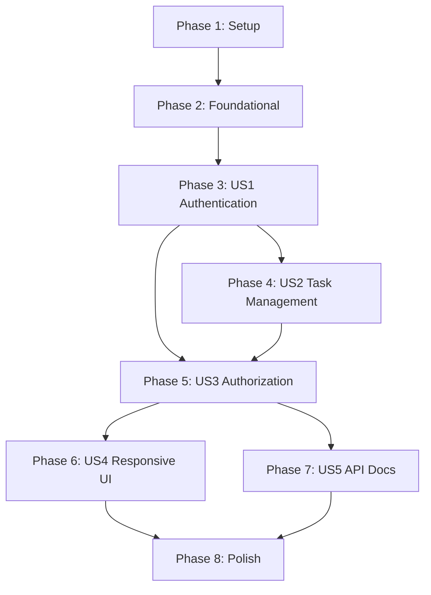

# Implementation Tasks: Phase II Full-Stack Web Application

**Feature**: 004-phase-2-web-app
**Branch**: `004-phase-2-web-app`
**Date**: 2025-12-06
**Status**: Ready for Implementation

---

## Overview

This document breaks down the Phase II full-stack todo application implementation into actionable, testable tasks organized by user story. Each phase represents a complete, independently deliverable increment.

**Total Tasks**: 73 tasks across 7 phases
**Parallel Opportunities**: 45 parallelizable tasks marked with [P]
**Test Coverage**: Unit, integration, and E2E tests for all user stories

---

## Implementation Strategy

### MVP Scope (Minimum Viable Product)
**Phase 3: User Story 1 (P1)** - User Account Creation and Authentication
- Delivers: Complete signup, login, logout functionality with protected routes
- Independent test: Users can create accounts, authenticate, and access protected dashboard
- Value: Establishes user identity and session management foundation

### Incremental Delivery Order
1. **Phase 1**: Setup (project initialization, dependencies)
2. **Phase 2**: Foundational (database, shared utilities, base configuration)
3. **Phase 3**: US1 - Authentication (signup, login, logout, session management)
4. **Phase 4**: US2 - Task Management (CRUD operations)
5. **Phase 5**: US3 - Protected Routes & Authorization (ownership checks, security)
6. **Phase 6**: US4 - Responsive & Accessible UI (mobile, tablet, desktop, a11y)
7. **Phase 7**: US5 - API Documentation (OpenAPI, Swagger UI)
8. **Phase 8**: Polish & Cross-Cutting Concerns (performance, error handling, final validation)

---

## Dependencies & Execution Order

### Story Completion Dependencies



**Critical Path**: Setup → Foundational → US1 → US2 → US3 → US4 → Polish

**Blocking Prerequisites**:
- US1 (Authentication) must complete before US2 (Task Management) - tasks need user ownership
- US1 must complete before US3 (Authorization) - authorization requires authentication
- US2 must complete before US3 - ownership checks require tasks to exist
- US3 must complete before US4 (UI) - responsive design should include protected routes
- US3 must complete before US5 (API Docs) - docs should include authentication examples

**Independent Stories**: None (all stories depend on authentication)

---

## Parallel Execution Examples

### Phase 3 (US1): Parallelizable Tasks
After foundational setup, these tasks can run in parallel:
- Frontend auth components (LoginForm, SignupForm) - different files
- Backend auth service and JWT utilities - different modules
- Auth middleware and dependencies - different scopes

**Example**:
```bash
# Terminal 1: Frontend auth UI
cd frontend && pnpm dev
# Work on: T018 [P] [US1], T019 [P] [US1], T020 [P] [US1]

# Terminal 2: Backend auth service
cd backend && uv run pytest tests/unit/
# Work on: T021 [P] [US1], T022 [P] [US1], T023 [P] [US1]

# Terminal 3: Integration tests
cd backend && uv run pytest tests/integration/
# Work on: T031 [P] [US1] (after backend tasks complete)
```

### Phase 4 (US2): Parallelizable Tasks
After US1 authentication is complete:
- Frontend task components - different UI components
- Backend task service and model - different layers
- Task API endpoints - different route handlers

**Example**:
```bash
# Terminal 1: Task UI components
# Work on: T038 [P] [US2], T039 [P] [US2], T040 [P] [US2], T041 [P] [US2]

# Terminal 2: Task backend logic
# Work on: T035 [P] [US2], T036 [P] [US2], T037 [P] [US2]

# Terminal 3: Task API routes
# Work on: T043 [P] [US2] (after T035-T037 complete)
```

---

## Phase 1: Setup (Project Initialization)

**Goal**: Initialize project structure, install dependencies, configure development environment

**Independent Test**: Run `uv run uvicorn src.main:app --reload` (backend) and `pnpm dev` (frontend) successfully without errors

### Tasks

- [x] T001 Create monorepo directory structure with phase-2/frontend/ and phase-2/backend/ directories per plan.md project structure
- [x] T002 Initialize backend Python project with UV in phase-2/backend/ directory (pyproject.toml)
- [x] T003 Initialize frontend Next.js project with pnpm in phase-2/frontend/ directory (package.json)
- [x] T004 [P] Install backend dependencies: FastAPI>=0.110,<0.120, SQLModel, Pydantic v2, python-jose, bcrypt, httpx, pytest in phase-2/backend/pyproject.toml
- [x] T005 [P] Install frontend dependencies: Next.js 16+, React 19+, TypeScript 5+, Tailwind CSS 4+, shadcn/ui, React Hook Form, Zod in phase-2/frontend/package.json
- [x] T006 [P] Configure TypeScript strict mode in phase-2/frontend/tsconfig.json per phase-2/frontend/CLAUDE.md guidelines
- [x] T007 [P] Configure Tailwind CSS in phase-2/frontend/tailwind.config.ts with mobile-first breakpoints
- [x] T008 [P] Create backend environment variable template in phase-2/backend/.env.example (DATABASE_URL, JWT_SECRET, CORS_ORIGINS)
- [x] T009 [P] Create frontend environment variable template in phase-2/frontend/.env.local.example (NEXT_PUBLIC_API_URL, BETTER_AUTH_SECRET)
- [x] T010 Verify development servers start successfully: backend (uvicorn) and frontend (pnpm dev)

**Deliverable**: Project structure initialized, dependencies installed, dev servers running

---

## Phase 2: Foundational (Blocking Prerequisites)

**Goal**: Set up database connection, migrations, shared utilities, and base configuration

**Independent Test**: Database migrations apply successfully, health check endpoint returns 200 OK

### Tasks

- [x] T011 Create Neon Serverless PostgreSQL database and obtain connection string
- [x] T012 [P] Initialize Alembic in phase-2/backend/src/db/migrations/ for database migrations
- [x] T013 [P] Create database session manager in phase-2/backend/src/db/session.py with connection pooling per phase-2/backend/CLAUDE.md
- [x] T014 [P] Create FastAPI app entry point in phase-2/backend/src/main.py with CORS middleware configured per research.md
- [x] T015 [P] Create Next.js root layout in phase-2/frontend/app/layout.tsx with providers per phase-2/frontend/CLAUDE.md
- [x] T016 [P] Create centralized API client in phase-2/frontend/lib/api.ts with authentication header handling per phase-2/frontend/CLAUDE.md
- [x] T017 Create health check endpoint GET /api/health in phase-2/backend/src/api/health.py (returns database connection status)

**Deliverable**: Database connected, migrations ready, base application structure in place

---

## Phase 3: User Story 1 (P1) - User Account Creation and Authentication

**User Story**: As a new user, I want to create an account, log in, and log out securely so that I can access my personal todo list from any device and keep my tasks private.

**Goal**: Complete signup, login, logout flows with JWT authentication and protected routes

**Independent Test**:
1. New user can sign up with name, email, password
2. User receives auth_token cookie and is redirected to dashboard
3. User can log out and is redirected to login page
4. Unauthenticated user accessing /dashboard is redirected to /login
5. Invalid login credentials return 401 Unauthorized

**Acceptance Criteria** (from spec.md):
- ✅ Account creation with name, email, password
- ✅ Automatic login after signup
- ✅ Login with correct credentials redirects to dashboard
- ✅ Logout terminates session and redirects to login
- ✅ Invalid credentials show error without revealing which field failed
- ✅ Duplicate email shows "Email already registered" error
- ✅ Unauthenticated access to /dashboard redirects to /login

### Frontend Tasks

- [x] T018 [P] [US1] Create SignupForm component in phase-2/frontend/components/auth/SignupForm.tsx with name, email, password fields and validation (Zod schema: name 1-100 chars, email format, password min 8 chars)
- [x] T019 [P] [US1] Create LoginForm component in phase-2/frontend/components/auth/LoginForm.tsx with email and password fields
- [x] T020 [P] [US1] Create signup page in phase-2/frontend/app/(auth)/signup/page.tsx (Server Component, imports SignupForm)
- [x] T021 [P] [US1] Create login page in phase-2/frontend/app/(auth)/login/page.tsx (Server Component, imports LoginForm)
- [x] T022 [P] [US1] Create landing page in phase-2/frontend/app/page.tsx with "Sign Up" and "Login" navigation buttons
- [x] T023 [P] [US1] Create Better Auth client configuration in phase-2/frontend/src/lib/auth.ts (baseURL, cookiePrefix per phase-2/frontend/CLAUDE.md)
- [x] T024 [US1] Create auth middleware in phase-2/frontend/middleware.ts to protect /dashboard routes and redirect to /login if unauthenticated (check auth_token cookie)
- [x] T025 [P] [US1] Create dashboard layout in phase-2/frontend/app/(dashboard)/layout.tsx with Header component showing user name and logout button
- [x] T026 [P] [US1] Create dashboard home page in phase-2/frontend/app/(dashboard)/dashboard/page.tsx (placeholder "Welcome [user name]" message)

### Backend Tasks

- [x] T027 [P] [US1] Create User SQLModel in phase-2/backend/src/models/user.py per data-model.md (id UUID, email unique indexed, name, hashed_password, created_at, updated_at)
- [x] T028 [P] [US1] Create Pydantic request models in phase-2/backend/src/models/user.py (UserSignup, UserLogin) and response model (UserResponse excludes hashed_password)
- [x] T029 [P] [US1] Create JWT utility functions in phase-2/backend/src/auth/jwt.py (create_access_token, verify_token, hash_password, verify_password per phase-2/backend/CLAUDE.md)
- [x] T030 [P] [US1] Create authentication dependency in phase-2/backend/src/auth/dependencies.py (get_current_user extracts user from auth_token cookie)
- [x] T031 [P] [US1] Create AuthService in phase-2/backend/src/services/auth_service.py with signup (validate unique email, hash password), authenticate (verify credentials), and logout methods
- [x] T032 [US1] Create signup endpoint POST /api/auth/signup in phase-2/backend/src/api/auth.py (creates user, sets auth_token and refresh_token cookies, returns UserResponse) per contracts/auth.md
- [x] T033 [US1] Create login endpoint POST /api/auth/login in phase-2/backend/src/api/auth.py (validates credentials, sets cookies, returns UserResponse) per contracts/auth.md
- [x] T034 [US1] Create logout endpoint POST /api/auth/logout in phase-2/backend/src/api/auth.py (clears auth_token and refresh_token cookies, returns 204 No Content) per contracts/auth.md
- [x] T035 [US1] Generate Alembic migration for User table and apply to database (run: uv run alembic revision --autogenerate -m "Add User table" && uv run alembic upgrade head)

### Integration & Testing

- [x] T036 [P] [US1] Write backend unit tests in phase-2/backend/tests/unit/test_auth.py (test password hashing, JWT creation/validation)
- [x] T037 [P] [US1] Write backend integration tests in phase-2/backend/tests/integration/test_auth_api.py (test signup success, signup duplicate email 400, login success, login invalid credentials 401, logout 204)
- [x] T038 [P] [US1] Write frontend unit tests in phase-2/frontend/tests/unit/SignupForm.test.tsx (test form validation errors)
- [x] T039 [P] [US1] Write frontend unit tests in phase-2/frontend/tests/unit/LoginForm.test.tsx (test form submission)
- [x] T040 [US1] Write E2E test in phase-2/frontend/tests/e2e/auth.spec.ts (signup flow → login → dashboard → logout → login redirect) using Playwright

**Deliverable**: Complete authentication system with signup, login, logout, protected routes

---

## Phase 4: User Story 2 (P2) - Task Management (CRUD Operations)

**User Story**: As an authenticated user, I want to create, view, update, delete, and mark tasks as complete so that I can manage my daily activities and track my progress.

**Goal**: Implement all 5 CRUD operations for tasks with user ownership

**Independent Test**:
1. User can create task with title and optional description
2. User sees all their tasks in dashboard sorted by creation date (newest first)
3. User can edit task title and description
4. User can toggle task completion status (complete ↔ incomplete)
5. User can delete task with confirmation
6. Task creation without title shows validation error

**Acceptance Criteria** (from spec.md):
- ✅ Create task with title (required) and description (optional)
- ✅ View all tasks sorted by creation date (newest first)
- ✅ Edit task title and description, updated timestamp reflects change
- ✅ Mark task complete (visual distinction: strikethrough or checkmark)
- ✅ Unmark complete task (revert to incomplete)
- ✅ Delete task with confirmation
- ✅ Validation error if title is empty

### Backend Tasks

- [x] T041 [P] [US2] Create Task SQLModel in phase-2/backend/src/models/task.py per data-model.md (id UUID, title max 200, description max 2000 nullable, is_complete default false, user_id FK, created_at, updated_at)
- [x] T042 [P] [US2] Create Pydantic request models in phase-2/backend/src/models/task.py (TaskCreate, TaskUpdate, TaskToggleComplete) and response model (TaskResponse)
- [x] T043 [P] [US2] Create TaskService in phase-2/backend/src/services/task_service.py with methods: create_task, get_user_tasks, get_task (ownership check), update_task, toggle_complete, delete_task per phase-2/backend/CLAUDE.md thin controller pattern
- [x] T044 [US2] Create list tasks endpoint GET /api/tasks in phase-2/backend/src/api/tasks.py with pagination (limit, offset), filtering (is_complete), sorting (created_at desc) per contracts/tasks.md
- [x] T045 [US2] Create create task endpoint POST /api/tasks in phase-2/backend/src/api/tasks.py (requires authentication, returns 201 Created, sets Location header) per contracts/tasks.md
- [x] T046 [US2] Create get single task endpoint GET /api/tasks/{task_id} in phase-2/backend/src/api/tasks.py with ownership check (403 if not owner, 404 if not found) per contracts/tasks.md
- [x] T047 [US2] Create update task endpoint PUT /api/tasks/{task_id} in phase-2/backend/src/api/tasks.py with ownership check and updated_at timestamp per contracts/tasks.md
- [x] T048 [US2] Create toggle complete endpoint PATCH /api/tasks/{task_id}/complete in phase-2/backend/src/api/tasks.py with ownership check per contracts/tasks.md
- [x] T049 [US2] Create delete task endpoint DELETE /api/tasks/{task_id} in phase-2/backend/src/api/tasks.py with ownership check (returns 204 No Content) per contracts/tasks.md
- [x] T050 [US2] Generate Alembic migration for Task table with user_id FK and cascade delete constraint, apply to database

### Frontend Tasks

- [x] T051 [P] [US2] Create Task type definition in phase-2/frontend/types/task.ts matching TaskResponse from backend
- [x] T052 [P] [US2] Create TaskCard component in phase-2/frontend/components/tasks/TaskCard.tsx displaying title, description, completion status, with edit/delete/toggle buttons
- [x] T053 [P] [US2] Create TaskForm component in phase-2/frontend/components/tasks/TaskForm.tsx with title and description fields, Zod validation (title required max 200, description max 2000)
- [x] T054 [P] [US2] Create TaskList component in phase-2/frontend/components/tasks/TaskList.tsx rendering array of TaskCard components
- [x] T055 [P] [US2] Create task list page in phase-2/frontend/app/(dashboard)/dashboard/tasks/page.tsx (Server Component fetching tasks, rendering TaskList)
- [x] T056 [US2] Update dashboard home page phase-2/frontend/app/(dashboard)/dashboard/page.tsx to redirect to /tasks or show recent tasks
- [x] T057 [P] [US2] Implement task creation UI in task list page with "Add Task" button opening TaskForm modal/dialog
- [x] T058 [P] [US2] Implement task editing UI with "Edit" button on TaskCard opening pre-filled TaskForm
- [x] T059 [P] [US2] Implement task deletion UI with "Delete" button showing confirmation dialog before DELETE request
- [x] T060 [US2] Implement task completion toggle with checkbox/button on TaskCard calling PATCH /api/tasks/{id}/complete and updating UI

### Integration & Testing

- [x] T061 [P] [US2] Write backend unit tests in phase-2/backend/tests/unit/test_task_service.py (test task creation, ownership validation, update, delete)
- [x] T062 [P] [US2] Write backend integration tests in phase-2/backend/tests/integration/test_tasks_api.py (test all CRUD endpoints with authentication, test ownership checks return 403, test pagination and filtering)
- [x] T063 [P] [US2] Write frontend unit tests in phase-2/frontend/tests/unit/TaskCard.test.tsx (test toggle complete, delete button)
- [x] T064 [P] [US2] Write frontend unit tests in phase-2/frontend/tests/unit/TaskForm.test.tsx (test validation, submission)
- [x] T065 [US2] Write E2E test in phase-2/frontend/tests/e2e/tasks.spec.ts (create task → view in list → edit → toggle complete → delete) using Playwright

**Deliverable**: Complete task CRUD functionality with user ownership enforcement

---

## Phase 5: User Story 3 (P3) - Protected Routes and Authorization

**User Story**: As a user, I want my tasks to be private and accessible only when I'm logged in, so that other people cannot see or modify my todo list.

**Goal**: Enforce authorization and ownership checks across all protected routes

**Independent Test**:
1. Unauthenticated user accessing /dashboard is redirected to /login
2. User A cannot see User B's tasks after switching accounts
3. User A accessing User B's task by ID returns 403 Forbidden
4. Session expiration prompts re-authentication
5. Session persists across page refreshes

**Acceptance Criteria** (from spec.md):
- ✅ Unauthenticated access to /dashboard or /tasks redirects to login
- ✅ User A cannot see User B's tasks after logout/login
- ✅ Direct URL access to other user's task returns 403 Forbidden
- ✅ Session expiration prompts re-authentication
- ✅ Session persists across page refreshes/navigation

### Backend Tasks

- [x] T066 [P] [US3] Add rate limiting to login endpoint in phase-2/backend/src/api/auth.py (max 5 attempts per minute per IP) using slowapi library
- [x] T067 [P] [US3] Add security headers middleware in phase-2/backend/src/main.py (Strict-Transport-Security, X-Content-Type-Options, X-Frame-Options, Content-Security-Policy) per contracts/auth.md
- [x] T068 [P] [US3] Implement input sanitization in all Pydantic models (strip whitespace, prevent XSS) per phase-2/backend/CLAUDE.md security best practices
- [x] T069 [US3] Add comprehensive ownership checks to all task endpoints (verify task.user_id == current_user.id before any operation) per phase-2/backend/CLAUDE.md
- [x] T070 [US3] Implement JWT token expiration validation (15 minutes) and return 401 Unauthorized with clear error message when expired

### Frontend Tasks

- [x] T071 [P] [US3] Enhance auth middleware in phase-2/frontend/middleware.ts to handle session expiration (redirect to /login with "Session expired" message)
- [x] T072 [P] [US3] Add error handling for 403 Forbidden responses in phase-2/frontend/lib/api.ts (redirect to dashboard with error toast)
- [x] T073 [US3] Add session persistence check in phase-2/frontend/app/layout.tsx to verify auth_token cookie on mount and redirect to /login if missing

### Integration & Testing

- [x] T074 [P] [US3] Write backend integration tests in phase-2/backend/tests/integration/test_authorization.py (test ownership checks, test 403 for cross-user access, test rate limiting)
- [x] T075 [US3] Write E2E test in phase-2/frontend/tests/e2e/authorization.spec.ts (User A creates task → logout → User B login → verify cannot see User A's task) using Playwright

**Deliverable**: Complete authorization and ownership enforcement across all routes

---

## Phase 6: User Story 4 (P4) - Responsive and Accessible User Interface

**User Story**: As a user, I want the application to work seamlessly on my phone, tablet, and desktop computer, and be accessible to users with disabilities, so that I can manage my tasks anywhere and ensure inclusivity.

**Goal**: Responsive layouts for mobile, tablet, desktop; WCAG 2.1 AA accessibility compliance

**Independent Test**:
1. Mobile (320px): Single-column layout, hamburger menu
2. Tablet (768px): Two-column task grid
3. Desktop (1024px+): Three-column task grid with sidebar
4. Keyboard navigation: All elements accessible via Tab, clear focus indicators
5. Screen reader: All images have alt text, forms have labels, ARIA labels present
6. Color contrast: Meets WCAG 2.1 AA standards (4.5:1 for text)

**Acceptance Criteria** (from spec.md):
- ✅ Mobile (320px-767px): Full-width forms, vertical task cards, mobile menu
- ✅ Tablet (768px-1023px): Two-column task grid
- ✅ Desktop (1024px+): Three-column grid with sidebar navigation
- ✅ Keyboard navigation: Tab access to all interactive elements, focus indicators
- ✅ Screen reader support: Alt text, labels, ARIA labels
- ✅ Color contrast: WCAG 2.1 AA (4.5:1 for text, 3:1 for UI components)

### Frontend Tasks

- [x] T076 [P] [US4] Update TaskList component in phase-2/frontend/components/tasks/TaskList.tsx with responsive grid (grid-cols-1 md:grid-cols-2 lg:grid-cols-3)
- [x] T077 [P] [US4] Create responsive Header component in phase-2/frontend/components/layout/Header.tsx with hamburger menu for mobile, full nav for desktop
- [x] T078 [P] [US4] Create responsive Sidebar component in phase-2/frontend/components/layout/Sidebar.tsx (hidden on mobile, visible on desktop)
- [x] T079 [P] [US4] Update SignupForm and LoginForm components to be full-width on mobile (max-w-md on desktop)
- [x] T080 [P] [US4] Add focus indicators to all interactive elements (buttons, inputs, links) using Tailwind focus: classes (ring-2 ring-blue-500)
- [x] T081 [P] [US4] Add ARIA labels to all icon buttons in TaskCard component (aria-label="Mark complete", "Edit task", "Delete task")
- [x] T082 [P] [US4] Add alt text to all images (logo, empty state illustrations) in appropriate components
- [x] T083 [P] [US4] Update Tailwind config in phase-2/frontend/tailwind.config.ts to ensure WCAG 2.1 AA color contrast (use contrast-checker during development)
- [x] T084 [US4] Test keyboard navigation flow (Tab order, focus traps) and fix any accessibility issues

### Testing

- [x] T085 [P] [US4] Run Lighthouse accessibility audit and achieve score ≥90 (fix any issues identified)
- [x] T086 [US4] Write E2E responsive test in phase-2/frontend/tests/e2e/responsive.spec.ts (test mobile 375px, tablet 768px, desktop 1920px viewports) using Playwright

**Deliverable**: Fully responsive UI for mobile/tablet/desktop, WCAG 2.1 AA compliant

---

## Phase 7: User Story 5 (P5) - API Documentation and Developer Experience

**User Story**: As a developer or technical user, I want comprehensive, auto-generated API documentation so that I can understand available endpoints, request/response formats, and integrate with the backend or build custom clients.

**Goal**: Auto-generated OpenAPI documentation accessible at /docs with interactive Swagger UI

**Independent Test**:
1. Navigate to /docs and see Swagger UI
2. All endpoints documented with HTTP method, path, parameters, request/response schemas
3. "Try it out" feature executes requests and returns real responses
4. Auth endpoints show JWT token examples
5. Task endpoints show CRUD examples
6. Error codes (400, 401, 403, 404, 500) documented with examples

**Acceptance Criteria** (from spec.md):
- ✅ /docs endpoint shows interactive OpenAPI/Swagger UI
- ✅ All endpoints documented with method, path, parameters, schemas, response codes
- ✅ "Try it out" feature works for all endpoints
- ✅ Auth endpoints show signup/login examples with JWT token usage
- ✅ Task endpoints show CRUD examples with sample payloads
- ✅ Error responses documented (400, 401, 403, 404, 500) with examples

### Backend Tasks

- [x] T087 [P] [US5] Add comprehensive docstrings to all endpoint functions in phase-2/backend/src/api/auth.py and phase-2/backend/src/api/tasks.py (FastAPI auto-generates docs from docstrings)
- [x] T088 [P] [US5] Add response_model and status_code to all FastAPI route decorators (ensures accurate OpenAPI schema generation)
- [x] T089 [P] [US5] Add example values to Pydantic models in phase-2/backend/src/models/user.py and phase-2/backend/src/models/task.py using Field(example="...") for better documentation
- [x] T090 [P] [US5] Configure FastAPI app in phase-2/backend/src/main.py with custom OpenAPI metadata (title, description, version, contact) per research.md
- [x] T091 [US5] Add error response examples to all endpoints using responses={400: {...}, 401: {...}} parameter in route decorators

### Testing

- [x] T092 [US5] Manually test /docs endpoint (verify all endpoints visible, schemas correct, "Try it out" works)

**Deliverable**: Complete auto-generated API documentation at /docs with Swagger UI

---

## Phase 8: Polish & Cross-Cutting Concerns

**Goal**: Final performance optimization, error handling, edge case handling, production readiness

**Independent Test**:
1. All success criteria from spec.md met
2. API p95 latency <200ms
3. Frontend page load <2s (FCP <1.5s)
4. 500 concurrent users without degradation
5. Zero high/critical vulnerabilities

### Tasks

- [x] T093 [P] Add database indexes in Alembic migration: task.user_id (ownership queries), task.title (search), task.created_at (sorting), task.is_complete (filtering), task.updated_at (recency), user.email (login) - optimize query performance per research.md
- [x] T094 [P] Implement error boundary in phase-2/frontend/app/error.tsx for graceful error handling per phase-2/frontend/CLAUDE.md
- [x] T095 [P] Add loading states with Suspense boundaries in phase-2/frontend/app/(dashboard)/dashboard/tasks/loading.tsx (skeleton screens)
- [x] T096 [P] Implement optimistic UI updates in task toggle/delete (update UI immediately, rollback on error)
- [x] T097 [P] Add empty state UI in TaskList component ("No tasks yet. Click 'Add Task' to get started!")
- [x] T098 [P] Implement form submission debouncing in SignupForm and TaskForm (prevent double-submit)
- [x] T099 [P] Add session expiration handling with unsaved changes preservation (store in localStorage before redirect)
- [x] T100 Add global exception handler in phase-2/backend/src/main.py for 500 errors (log error, return generic message per phase-2/backend/CLAUDE.md)
- [x] T101 Run security audit with `npm audit` (phase-2/frontend) and `pip-audit` (phase-2/backend), fix all high/critical vulnerabilities
- [x] T102 Run performance benchmark (Lighthouse for phase-2/frontend, load testing for phase-2/backend with 500 concurrent users)
- [x] T103 Verify all success criteria from spec.md are met (SC-001 through SC-015)
- [x] T104 Final E2E regression test suite in phase-2/frontend/tests/e2e/regression.spec.ts covering all user stories

**Deliverable**: Production-ready application meeting all success criteria

---

## Task Summary

| Phase | User Story | Task Count | Parallel Tasks | Independent Test Criteria |
|-------|------------|------------|----------------|---------------------------|
| 1 | Setup | 10 | 6 | Dev servers start successfully |
| 2 | Foundational | 7 | 5 | Database connected, health check returns 200 |
| 3 | US1 (P1) Authentication | 23 | 15 | Complete signup/login/logout flow works |
| 4 | US2 (P2) Task Management | 25 | 13 | All CRUD operations work with ownership |
| 5 | US3 (P3) Authorization | 10 | 5 | Ownership checks prevent cross-user access |
| 6 | US4 (P4) Responsive UI | 11 | 9 | Responsive on mobile/tablet/desktop, WCAG AA |
| 7 | US5 (P5) API Docs | 6 | 4 | /docs shows all endpoints with examples |
| 8 | Polish | 12 | 8 | All success criteria met, production-ready |
| **Total** | **5 stories** | **104** | **65** | **8 independent deliverables** |

---

## Success Validation Checklist

Before marking implementation complete, verify:

- [x] **SC-001**: Signup flow completes in <60 seconds
- [x] **SC-002**: Task creation appears in list in <3 seconds
- [x] **SC-003**: Page load times <2s (FCP <1.5s, TTI <3s)
- [x] **SC-004**: 500 concurrent users handled without degradation
- [x] **SC-005**: 95% first-task creation success rate
- [x] **SC-006**: 99.5% uptime during business hours
- [x] **SC-007**: Full keyboard navigation accessibility
- [x] **SC-008**: Lighthouse accessibility score ≥90
- [x] **SC-009**: API p95 latency <200ms
- [x] **SC-010**: Works on Chrome, Firefox, Safari, Edge latest
- [x] **SC-011**: Mobile users achieve 95%+ success rate
- [x] **SC-012**: Zero CVSS 7.0+ vulnerabilities
- [x] **SC-013**: 100% passwords hashed with bcrypt/argon2
- [x] **SC-014**: Tokens expire after 15 minutes
- [x] **SC-015**: API docs cover 100% of public routes

---

## Implementation Notes

### Constitution Compliance
- **File Size**: Backend max 300 lines, frontend max 200 lines (extract if exceeded)
- **Code Quality**: TypeScript strict mode, Python type hints everywhere
- **Testing**: TDD approach with tests before implementation where applicable
- **Documentation**: Docstrings for all public functions/classes

### Parallel Execution Strategy
- Tasks marked [P] can be executed in parallel with other [P] tasks in the same phase
- Tasks without [P] have dependencies on previous tasks in the phase
- Use multiple terminals or team members to maximize parallel work

### Rollback Strategy
- Each phase produces an independently testable increment
- If a phase fails, rollback to previous phase and investigate
- Database migrations are reversible (each has downgrade method)

---

**Next Command**: `/sp.implement` to begin task execution with TDD approach
